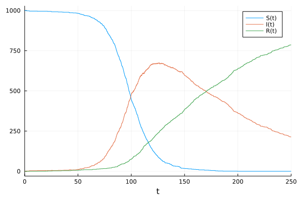
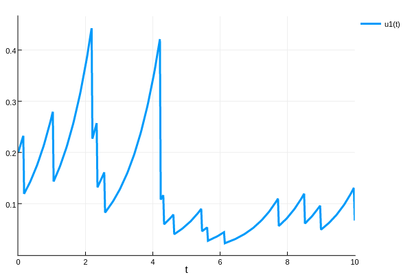

# JumpProcesses.jl

[](https://julialang.zulipchat.com/#narrow/stream/279055-sciml-bridged)
[](http://jump.sciml.ai/stable/)
[](https://docs.sciml.ai/dev/modules/JumpProcesses/)

[](https://coveralls.io/github/SciML/JumpProcesses.jl?branch=master)
[](https://codecov.io/gh/SciML/JumpProcesses.jl)
[](https://github.com/SciML/JumpProcesses.jl/actions?query=workflow%3ACI)

[](https://github.com/SciML/ColPrac)
[](https://github.com/SciML/SciMLStyle)

*Note, JumpProcesses.jl is a renaming of DiffEqJump.jl, providing the current version of the latter.*

JumpProcesses.jl provides methods for simulating jump processes, known as
stochastic simulation algorithms (SSAs), Doob's method, Gillespie methods, or
Kinetic Monte Carlo methods across different fields of science. It also enables the
incorporation of jump processes into hybrid jump-ODE and jump-SDE models,
including jump diffusions.

JumpProcesses is a component package in the [SciML](https://sciml.ai/) ecosystem,
and one of the core solver libraries included in
[DifferentialEquations.jl](https://github.com/JuliaDiffEq/DifferentialEquations.jl).

For information on using the package,
[see the stable documentation](http://jump.sciml.ai/stable/). Use the
[in-development documentation](http://jump.sciml.ai/dev/) for the version of
the documentation, which contains the unreleased features. This documentation includes
- [a tutorial on simulating basic Poisson processes](https://jump.sciml.ai/stable/tutorials/simple_poisson_process/)
- [a tutorial and details on using JumpProcesses to simulate jump processes via SSAs (i.e. Gillespie methods)](https://jump.sciml.ai/stable/tutorials/discrete_stochastic_example/),
- [a tutorial on simulating jump-diffusion processes](https://jump.sciml.ai/stable/tutorials/jump_diffusion/),
- [a reference on the types of jumps and available simulation methods](https://jump.sciml.ai/stable/jump_types/),
- [a reference on jump time stepping methods](https://jump.sciml.ai/stable/jump_solve/),
- [a FAQ](https://jump.sciml.ai/stable/faq) with information on changing parameters between simulations and using callbacks,
- [the JumpProcesses.jl API documentation](https://jump.sciml.ai/stable/api/).

## Installation
There are two ways to install `JumpProcesses.jl`. First, users may install the meta
`DifferentialEquations.jl` package, which installs and wraps `OrdinaryDiffEq.jl`
for solving ODEs, `StochasticDiffEq.jl` for solving SDEs, and `JumpProcesses.jl`,
along with a number of other useful packages for solving models involving ODEs,
SDEs and/or jump process. This single install will provide the user with all of
the facilities for developing and solving Jump problems.

To install the `DifferentialEquations.jl` package, refer to the following link
for complete [installation
details](https://docs.sciml.ai/dev/modules/DiffEqDocs/).

If the user wishes to separately install the `JumpProcesses.jl` library, which is a
lighter dependency than `DifferentialEquations.jl`, then the following code will
install `JumpProcesses.jl` using the Julia package manager:
```julia
using Pkg
Pkg.add("JumpProcesses")
```

## Examples

### Stochastic Chemical Kinetics SIR Model
Here we consider the stochastic chemical kinetics jump process model for the
basic SIR model, involving three species, $(S,I,R)$, that can undergo the
reactions $S + I \to 2I$ and $I \to R$ (each represented as a jump process)
```julia
using JumpProcesses, Plots

# here we order S = 1, I = 2, and R = 3
# substrate stoichiometry:
substoich = [[1 => 1, 2 => 1],    # 1*S + 1*I
             [2 => 1]]            # 1*I
# net change by each jump type
netstoich = [[1 => -1, 2 => 1],   # S -> S-1, I -> I+1
             [2 => -1, 3 => 1]]   # I -> I-1, R -> R+1
# rate constants for each jump
p     = (0.1/1000, 0.01)

# p[1] is rate for S+I --> 2I, p[2] for I --> R
pidxs = [1, 2]

maj   = MassActionJump(substoich, netstoich; param_idxs=pidxs)

u₀    = [999, 1, 0]       #[S(0),I(0),R(0)]
tspan = (0.0, 250.0)
dprob = DiscreteProblem(u₀, tspan, p)

# use the Direct method to simulate
jprob = JumpProblem(dprob, Direct(), maj)

# solve as a pure jump process, i.e. using SSAStepper
sol   = solve(jprob, SSAStepper())
plot(sol)
```



Instead of `MassActionJump`, we could have used the less efficient, but more
flexible, `ConstantRateJump` type
```julia
rate1(u, p, t) = p[1] * u[1] * u[2]  # p[1]*S*I
function affect1!(integrator)
    integrator.u[1] -= 1         # S -> S - 1
    integrator.u[2] += 1         # I -> I + 1
end
jump = ConstantRateJump(rate1, affect1!)

rate2(u, p, t) = p[2] * u[2]      # p[2]*I
function affect2!(integrator)
    integrator.u[2] -= 1        # I -> I - 1
    integrator.u[3] += 1        # R -> R + 1
end
jump2 = ConstantRateJump(rate2, affect2!)
jprob = JumpProblem(dprob, Direct(), jump, jump2)
sol   = solve(jprob, SSAStepper())
```

### Jump-ODE Example
Let's solve an ODE for exponential growth, but coupled to a constant rate jump
(Poisson) process that halves the solution each time it fires
```julia
using DifferentialEquations, Plots

# du/dt = u is the ODE part
function f(du, u, p, t)
    du[1] = u[1]
end
u₀ = [0.2]
tspan = (0.0, 10.0)
prob = ODEProblem(f, u₀, tspan)

# jump part

# fires with a constant intensity of 2
rate(u, p, t) = 2

# halve the solution when firing
affect!(integrator) = (integrator.u[1] = integrator.u[1]/2)
jump = ConstantRateJump(rate, affect!)

# use the Direct method to handle simulating the jumps
jump_prob = JumpProblem(prob, Direct(), jump)

# now couple to the ODE, solving the ODE with the Tsit5 method
sol = solve(jump_prob, Tsit5())
plot(sol)
```




## Contributing and Getting Help

- Please refer to the
  [SciML ColPrac: Contributor's Guide on Collaborative Practices for Community Packages](https://github.com/SciML/ColPrac/blob/master/README.md)
  for guidance on PRs, issues, and other matters relating to contributing to SciML.
- See the [SciML Style Guide](https://github.com/SciML/SciMLStyle) for common coding practices and other style decisions.
- There are a few community forums for getting help and asking questions:
    - The #diffeq-bridged and #sciml-bridged channels in the
      [Julia Slack](https://julialang.org/slack/)
    - The #diffeq-bridged and #sciml-bridged channels in the
      [Julia Zulip](https://julialang.zulipchat.com/#narrow/stream/279055-sciml-bridged)
    - The [Julia Discourse forums](https://discourse.julialang.org)
    - See also the [SciML Community page](https://sciml.ai/community/)

