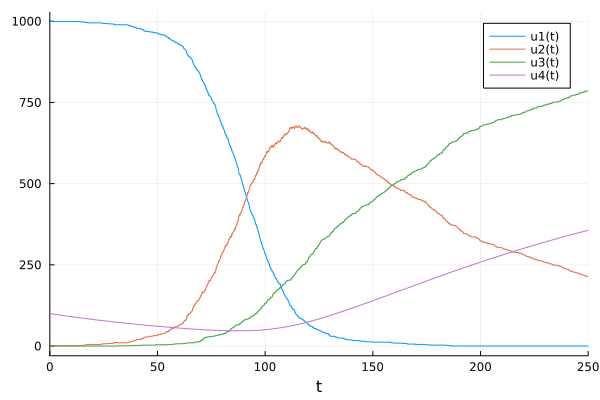
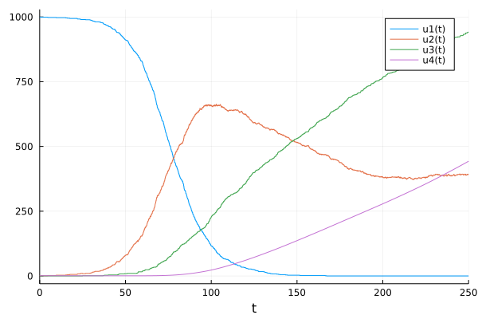

# Hybrid Jump-Differential Equation Models

## Adding Jumps to a Differential Equation

If we instead used some form of differential equation instead of a
`DiscreteProblem`, we would couple the jumps/reactions to the differential
equation. Let's define an ODE problem, where the continuous part only acts on
some new 4th component:

```julia
using OrdinaryDiffEq
function f(du,u,p,t)
  du[4] = u[2]*u[3]/100000 - u[1]*u[4]/100000
end
u₀   = [999.0,1.0,0.0,100.0]
prob = ODEProblem(f,u₀,tspan,p)
```

Notice we gave the 4th component a starting value of 100.0, and used floating
point numbers for the initial condition since some solution components now
evolve continuously. The same steps as above will allow us to solve this hybrid
equation when using `ConstantRateJumps` (or `MassActionJump`s). For example, we
can solve it using the `Tsit5()` method via:

```julia
jump_prob = JumpProblem(prob,Direct(),jump,jump2)
sol = solve(jump_prob,Tsit5())
```



## [Adding a VariableRateJump](@id VariableRateJumpSect)

Now let's consider adding a reaction whose rate changes continuously with the
differential equation. To continue our example, let's let there be a new
jump/reaction with rate depending on `u[4]`

```julia
rate3(u,p,t) = 1e-2*u[4]
function affect3!(integrator)
  integrator.u[2] += 1
end
jump3 = VariableRateJump(rate3,affect3!)
```

Notice, since `rate3` depends on a variable that evolves continuously, and hence
is not constant between jumps, we must use a `VariableRateJump`.

Solving the equation is exactly the same:

```julia
u₀   = [999.0,1.0,0.0,1.0]
prob = ODEProblem(f,u₀,tspan,p)
jump_prob = JumpProblem(prob,Direct(),jump,jump2,jump3)
sol = solve(jump_prob,Tsit5())
```



*Note that `VariableRateJump`s require a continuous problem, like an
ODE/SDE/DDE/DAE problem.*

Lastly, we are not restricted to ODEs. For example, we can solve the same jump
problem except with multiplicative noise on `u[4]` by using an `SDEProblem`
instead:

```julia
using StochasticDiffEq
function g(du,u,p,t)
  du[4] = 0.1u[4]
end

prob = SDEProblem(f,g,[999.0,1.0,0.0,1.0],(0.0,250.0), p)
jump_prob = JumpProblem(prob,Direct(),jump,jump2,jump3)
sol = solve(jump_prob,SRIW1())
```


For more details about `VariableRateJump`s see [Defining a Variable Rate
Jump](@ref).
